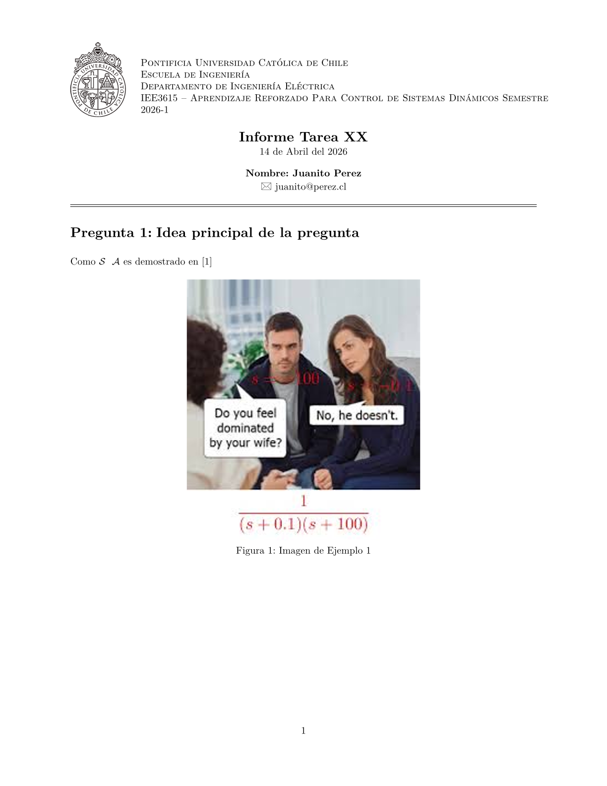

# :page_facing_up: typst-templates
A collection of different templates made for Typst.

## :memo: Usage

For writing Typst I recommend either VS Code, VS Codium, Google's Antigravity or any other VS Code based editor, solely for the use of the [Tinymist](https://github.com/Myriad-Dreamin/tinymist) extension.
Within GitHub you can explore the files and folders to find the template you want to use.

To use a template, you can either:

1. Clone the git repository to your machine and copy the folder with the template over to your desired location.
2. Download a specific template's folder using [DownGit](https://downgit.github.io/), without cloning the entire repository or by clicking the link in this README.
3. Download and copy the <template-name>.typ file on its own to your project and modify it.
4. Use the template as a reference to create your own template.

> \[!IMPORTANT]
> Some templates may include custom font files. If you are using Typst in the web app, simply include the font file in the project folder. If you are using Typst locally, make sure to install the font files on your system so that Typst can recognize them.

## :page_facing_up: Templates

### LaTeX-like Homework
> 
> 
> [Download](https://downgit.github.io/#/home?url=https://github.com/lnatero/typst-templates/tree/main/UC/LaTeX-like_Homework)
>
> This template is a LaTeX-like homework template for Typst, that includes the ability to change the faculty, department, course name, etc. It also includes the font Garamond-Math to be used for the `#cal()` function, to have similar math typography to LaTeX.
